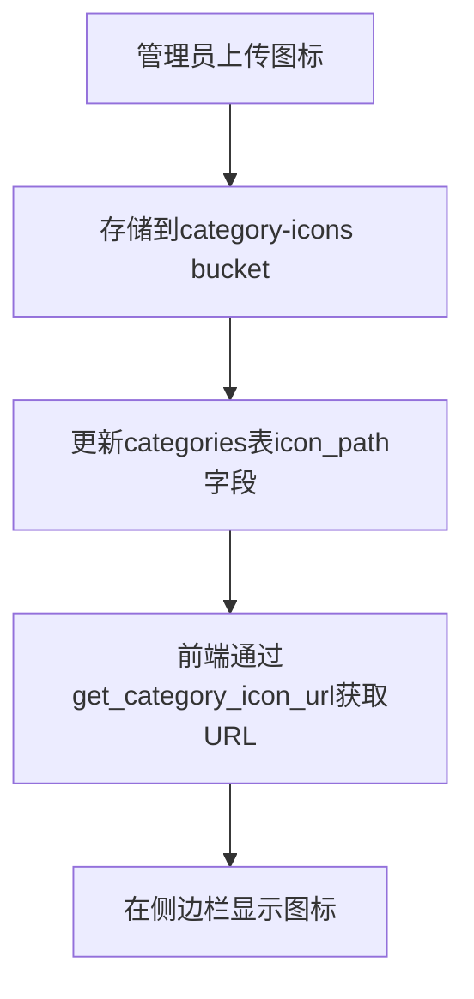
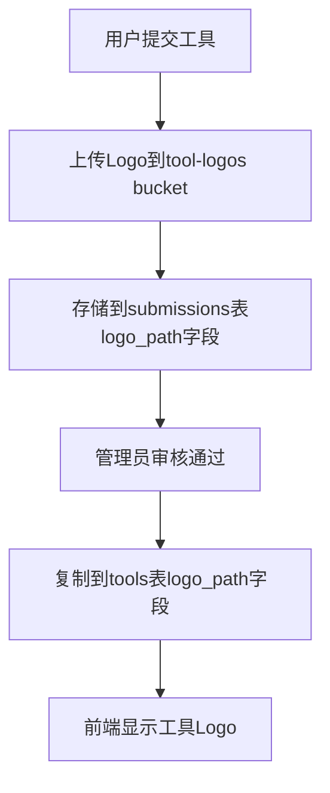
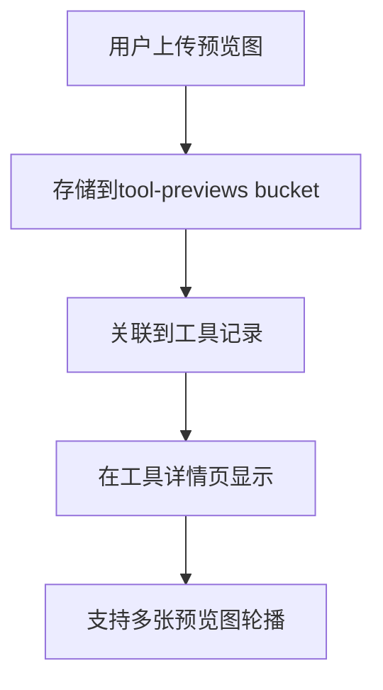

# 存储设计方案 - Storage Design

## 📋 概述

本文档详细描述了AI工具目录应用的Supabase存储bucket设计方案，用于存储三种类型的图片资源：分类图标、工具Logo和工具预览图。

## 🗂️ Bucket结构设计

### 1. category-icons (分类图标存储)

**用途**: 存储侧边栏分类的图标图片

**配置**:
- **Bucket ID**: `category-icons`
- **公开访问**: ✅ 是 (用于网站显示)
- **文件大小限制**: 2MB
- **支持格式**: PNG, JPEG, SVG, WebP

**文件路径规范**:
```
category-icons/
├── {category_slug}.svg     # 推荐使用SVG格式
├── {category_slug}.png     # 或PNG格式
└── {category_slug}.webp    # 或WebP格式
```

**示例**:
```
category-icons/
├── ai-writing.svg
├── image-generation.png
├── code-assistant.svg
└── productivity.webp
```

### 2. tool-logos (工具Logo存储)

**用途**: 存储AI工具的Logo图片

**配置**:
- **Bucket ID**: `tool-logos`
- **公开访问**: ✅ 是 (用于工具卡片显示)
- **文件大小限制**: 5MB
- **支持格式**: PNG, JPEG, SVG, WebP

**文件路径规范**:
```
tool-logos/
└── {user_id}/
    ├── {tool_slug}.png
    ├── {tool_slug}.svg
    └── {tool_slug}.webp
```

**示例**:
```
tool-logos/
├── user123/
│   ├── chatgpt.png
│   ├── midjourney.svg
│   └── claude.webp
└── user456/
    ├── copilot.png
    └── cursor.svg
```

### 3. tool-previews (工具预览图存储)

**用途**: 存储AI工具的预览截图和演示图片

**配置**:
- **Bucket ID**: `tool-previews`
- **公开访问**: ✅ 是 (用于工具详情页显示)
- **文件大小限制**: 10MB
- **支持格式**: PNG, JPEG, WebP, GIF

**文件路径规范**:
```
tool-previews/
└── {user_id}/
    └── {tool_slug}/
        ├── screenshot1.png
        ├── screenshot2.jpg
        ├── demo.gif
        └── interface.webp
```

**示例**:
```
tool-previews/
├── user123/
│   ├── chatgpt/
│   │   ├── chat-interface.png
│   │   ├── code-generation.jpg
│   │   └── demo.gif
│   └── midjourney/
│       ├── art-creation.png
│       └── style-examples.webp
└── user456/
    └── copilot/
        ├── code-completion.png
        └── suggestions.jpg
```

## 🔒 安全策略 (RLS Policies)

### 分类图标安全策略

| 操作 | 权限 | 说明 |
|------|------|------|
| **查看** | 🌍 所有人 | 公开访问，用于网站显示 |
| **上传** | 👑 管理员 | 只有管理员可以添加分类图标 |
| **更新** | 👑 管理员 | 只有管理员可以修改分类图标 |
| **删除** | 👑 管理员 | 只有管理员可以删除分类图标 |

### 工具Logo安全策略

| 操作 | 权限 | 说明 |
|------|------|------|
| **查看** | 🌍 所有人 | 公开访问，用于工具卡片显示 |
| **上传** | 🔐 认证用户 | 用户可以为自己提交的工具上传Logo |
| **更新** | 👤 文件所有者 + 👑 管理员 | 只有文件所有者或管理员可以修改 |
| **删除** | 👤 文件所有者 + 👑 管理员 | 只有文件所有者或管理员可以删除 |

### 工具预览图安全策略

| 操作 | 权限 | 说明 |
|------|------|------|
| **查看** | 🌍 所有人 | 公开访问，用于工具详情页显示 |
| **上传** | 🔐 认证用户 | 用户可以为自己的工具上传预览图 |
| **更新** | 👤 文件所有者 + 👑 管理员 | 只有文件所有者或管理员可以修改 |
| **删除** | 👤 文件所有者 + 👑 管理员 | 只有文件所有者或管理员可以删除 |

## 🛠️ 辅助函数

### URL生成函数

```sql
-- 获取分类图标URL
SELECT get_category_icon_url('ai-writing.svg');
-- 返回: https://your-project.supabase.co/storage/v1/object/public/category-icons/ai-writing.svg

-- 获取工具Logo URL
SELECT get_tool_logo_url('user123/chatgpt.png');
-- 返回: https://your-project.supabase.co/storage/v1/object/public/tool-logos/user123/chatgpt.png

-- 获取工具预览图URL
SELECT get_tool_preview_url('user123/chatgpt/screenshot1.jpg');
-- 返回: https://your-project.supabase.co/storage/v1/object/public/tool-previews/user123/chatgpt/screenshot1.jpg
```

### 清理函数

```sql
-- 清理未使用的分类图标
SELECT cleanup_unused_category_icons();

-- 清理未使用的工具Logo
SELECT cleanup_unused_tool_logos();

-- 清理未使用的工具预览图
SELECT cleanup_unused_tool_previews();

-- 执行所有清理任务
SELECT * FROM run_storage_cleanup();
```

### 统计函数

```sql
-- 查看存储使用统计
SELECT * FROM get_storage_stats();
```

## 📊 存储优化策略

### 1. 文件格式建议

| 用途 | 推荐格式 | 原因 |
|------|----------|------|
| **分类图标** | SVG > WebP > PNG | SVG矢量可缩放，WebP压缩率高 |
| **工具Logo** | SVG > WebP > PNG | 同上，适合各种尺寸显示 |
| **预览图** | WebP > JPEG > PNG | WebP压缩率高，适合大图片 |

### 2. 文件大小控制

- **分类图标**: 2MB限制，推荐 < 100KB
- **工具Logo**: 5MB限制，推荐 < 500KB  
- **预览图**: 10MB限制，推荐 < 2MB

### 3. 命名规范

- 使用小写字母和连字符
- 避免特殊字符和空格
- 包含有意义的描述性名称
- 示例: `ai-writing-tool.svg`, `screenshot-main-interface.webp`

## 🔄 数据流程

### 1. 分类图标流程



### 2. 工具Logo流程



### 3. 工具预览图流程



## 💡 使用示例

### 前端上传示例 (JavaScript)

```javascript
import { supabase } from './supabase-client'

// 上传工具Logo
async function uploadToolLogo(file, userId, toolSlug) {
  const fileName = `${userId}/${toolSlug}.${file.name.split('.').pop()}`
  
  const { data, error } = await supabase.storage
    .from('tool-logos')
    .upload(fileName, file, {
      cacheControl: '3600',
      upsert: true
    })
  
  if (error) throw error
  return data.path
}

// 上传工具预览图
async function uploadToolPreview(file, userId, toolSlug, index) {
  const fileName = `${userId}/${toolSlug}/preview-${index}.${file.name.split('.').pop()}`
  
  const { data, error } = await supabase.storage
    .from('tool-previews')
    .upload(fileName, file, {
      cacheControl: '3600',
      upsert: true
    })
  
  if (error) throw error
  return data.path
}

// 获取图片URL
function getImageUrl(bucket, path) {
  const { data } = supabase.storage
    .from(bucket)
    .getPublicUrl(path)
  
  return data.publicUrl
}
```

### 后端处理示例 (SQL)

```sql
-- 创建工具时关联Logo
INSERT INTO tools (name, slug, logo_path, ...)
VALUES ('ChatGPT', 'chatgpt', 'user123/chatgpt.png', ...);

-- 批量获取工具及其Logo URL
SELECT 
  t.*,
  get_tool_logo_url(t.logo_path) as logo_url
FROM tools t
WHERE t.status = 'published';

-- 获取分类及其图标URL
SELECT 
  c.*,
  get_category_icon_url(c.icon_path) as icon_url
FROM categories c
ORDER BY c.name;
```

## 🧹 维护指南

### 定期清理任务

建议设置定期任务（如每周执行一次）来清理未使用的文件：

```sql
-- 每周日执行清理任务
SELECT * FROM run_storage_cleanup();
```

### 监控存储使用

定期检查存储使用情况：

```sql
-- 查看各bucket的使用统计
SELECT * FROM get_storage_stats();
```

### 备份策略

- 重要的分类图标应该有本地备份
- 工具Logo和预览图可以通过重新上传恢复
- 建议定期导出存储清单

## 🚀 扩展建议

### 1. 图片处理优化

- 集成图片压缩服务（如TinyPNG API）
- 自动生成多种尺寸的缩略图
- 支持WebP格式自动转换

### 2. CDN加速

- 配置Supabase CDN加速
- 考虑使用第三方CDN服务
- 实现图片懒加载

### 3. 高级功能

- 图片水印添加
- 批量上传和管理
- 图片编辑功能集成
- AI图片标签和分类

### 4. 监控和分析

- 图片访问统计
- 存储成本分析
- 用户上传行为分析
- 性能监控和优化

## 📝 注意事项

1. **文件命名**: 确保文件名唯一性，避免覆盖
2. **权限控制**: 严格按照RLS策略控制访问权限
3. **存储成本**: 定期清理未使用文件以控制成本
4. **性能优化**: 使用适当的图片格式和压缩
5. **备份策略**: 重要文件应有备份机制
6. **安全考虑**: 验证上传文件类型和大小
7. **用户体验**: 提供上传进度和错误提示

## 🔗 相关文档

- [数据库设计总览](./README.md)
- [分类表设计](./categories-design.md)
- [工具表设计](./tools-design.md)
- [提交表设计](./submissions-design.md)
- [Supabase存储文档](https://supabase.com/docs/guides/storage)